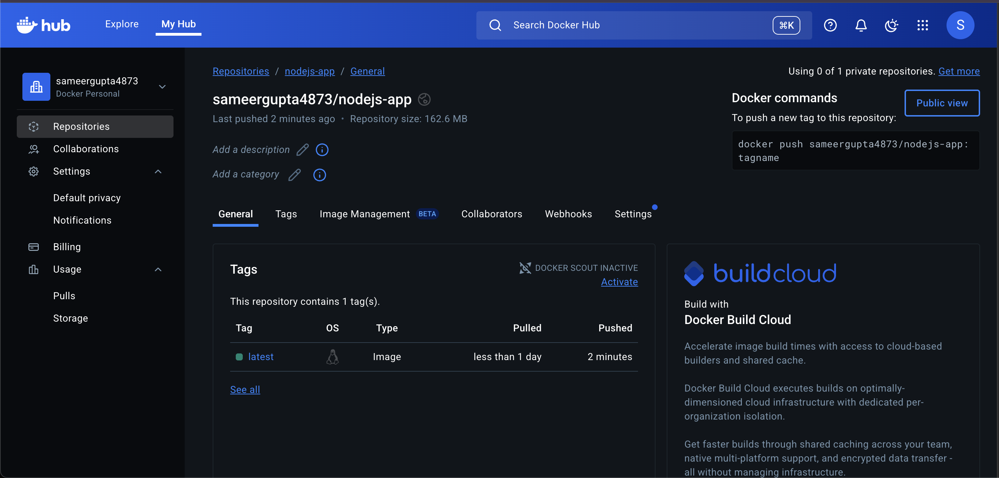
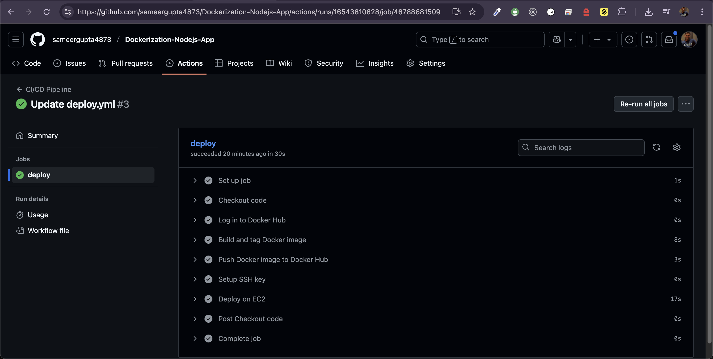
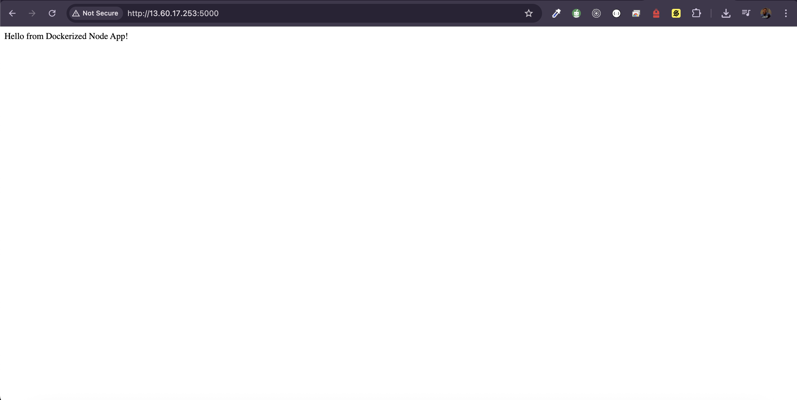

# 🚀 DevOps Project: Dockerized Node.js App with CI/CD Pipeline (GitHub Actions + EC2 Deployment)

## 🎯 Goal
Set up a production-grade DevOps workflow that containerizes a Node.js backend application using Docker, pushes the image to Docker Hub, and deploys it automatically to an AWS EC2 instance using GitHub Actions.

---

## 🛠️ Tech Stack
- **Node.js**
- **Docker & Docker Hub**
- **GitHub Actions**
- **AWS EC2**
- **Docker Compose**
- **SSH**

---

## 🔧 Project Breakdown

### 1️⃣ Dockerization of Node.js App

**Dockerfile**
```dockerfile
FROM node:18
WORKDIR /app
COPY package*.json ./
RUN npm install
COPY . .
EXPOSE 5000
CMD ["node", "server.js"]
```

**Steps to Dockerize and Push**
```bash
# Build the Docker image
docker build -t <your-dockerhub-username>/nodejs-app:latest .

# Run container locally for testing
docker run -p 5000:5000 <your-dockerhub-username>/nodejs-app:latest

# Push to Docker Hub
docker login
docker push <your-dockerhub-username>/nodejs-app:latest
```

---

### 2️⃣ CI/CD Pipeline with GitHub Actions

**GitHub Actions Workflow: `.github/workflows/deploy.yml`**
```yaml
name: CI/CD Pipeline

on:
  push:
    branches:
      - master

jobs:
  deploy:
    runs-on: ubuntu-latest

    steps:
      - name: Checkout code
        uses: actions/checkout@v3

      - name: Log in to Docker Hub
        run: echo "${{ secrets.DOCKER_PASSWORD }}" | docker login -u "${{ secrets.DOCKER_USERNAME }}" --password-stdin

      - name: Build and tag Docker image
        run: |
          docker build -t ${{ secrets.DOCKER_USERNAME }}/nodejs-app:latest ./backend

      - name: Push Docker image to Docker Hub
        run: |
          docker push ${{ secrets.DOCKER_USERNAME }}/nodejs-app:latest

      - name: Setup SSH key
        run: |
          echo "${{ secrets.EC2_KEY }}" | base64 -d > private_key.pem
          chmod 600 private_key.pem

      - name: Deploy on EC2
        run: |
          ssh -o StrictHostKeyChecking=no -i private_key.pem ${{ secrets.EC2_USER }}@${{ secrets.EC2_HOST }} "
          cd ~/Dockerization-Nodejs-App
          git pull origin master
          docker pull ${{ secrets.DOCKER_USERNAME }}/nodejs-app:latest
          docker-compose down
          docker-compose up -d
          "
```

---

## 🔐 GitHub Secrets Used
| Secret Name     | Purpose                               |
|------------------|----------------------------------------|
| `DOCKER_USERNAME` | Docker Hub username                   |
| `DOCKER_PASSWORD` | Docker Hub password                   |
| `EC2_KEY`         | Base64 encoded PEM file for SSH access|
| `EC2_USER`        | EC2 instance username (usually `ubuntu`)|
| `EC2_HOST`        | Public IP or DNS of EC2 instance      |

---

## ✅ Outcome
- 🚢 Dockerized Node.js application
- 🔁 Automated build and push using GitHub Actions
- ☁️ Continuous deployment to AWS EC2 via SSH
- 📦 Scalable and production-ready DevOps pipeline

---

## 📸 Screenshots
- 
- 
- 
